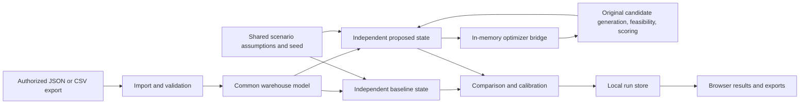

# Warehouse simulator sandbox architecture

This local MVP lets a warehouse import historical records, replay a current-policy baseline, generate suggestions, and estimate the outcome of adopting those suggestions. It has no connection to a live WMS and no production execution path. A suggestion is a simulated proposal, never a command sent to a warehouse.

## Running the prototype

Use the project's isolated Python environment. The local server and event simulator use standard library components; the original optimizer pipeline requires the small dependency set installed in `.venv-sandbox`:

```sh
.venv-sandbox/bin/python -m warehouse_sandbox.server --port 8876
```

Open `http://127.0.0.1:8876`. Load the demonstration warehouse or import JSON/CSV, adjust the scenario assumptions, run the comparison, and inspect the resulting suggestions and timelines. Runs are saved to the local `runs/` directory, and can be downloaded as full JSON or a suggestions CSV. Uploaded datasets are held in memory until a run is saved. Saved runs include their source records; use anonymized data and delete local run files according to the pilot's retention agreement.

Run physical-invariant and validation tests with:

```sh
.venv-sandbox/bin/python -m unittest discover -s tests_sandbox -v
```

Recommendations run the actual optimizer code in the Desktop copy at `warehouse-preposition-optimizer/src/`: `PrePositionScheduler.generate_candidates`, `FeasibilityEngine`, and `MovementScorer`. The bridge feeds those classes an in-memory warehouse snapshot and uses their returned value-function scores to rank suggestions. The original repository remains separate. The copied scorer accepts an optional replay clock; its default remains the normal wall clock for other callers.

## Data flow and boundaries



The server binds to `127.0.0.1`; requests and generated files stay on the user's machine. The browser calls relative local endpoints. There are no WMS credentials, external HTTP clients, database connections, equipment commands, webhooks, or writeback endpoints. This is a local prototype and must not be exposed as a public HTTP service.

| Component | Responsibility | Boundary |
| --- | --- | --- |
| `warehouse_sandbox/importer.py` | Parse tabular imports, normalize records, validate references and quantities, summarize data | Customer files become a checked common model; invalid imports produce actionable errors |
| `warehouse_sandbox/engine.py` | Replay events, check physical eligibility, simulate adoption, calculate branch metrics | Independent inventory and resources for each branch; computes outcomes from in-memory data |
| `warehouse_sandbox/optimizer_bridge.py` | Convert visible simulation state to original domain models and run the original candidate pipeline | In-memory WMS adapter, scoped pallet/order context, simulated clock, disabled dispatch queue |
| `warehouse-preposition-optimizer/src/` | Generate candidates, enforce original feasibility constraints, calculate the original movement value function | Imported from the Desktop copy; candidate-generation path only |
| `warehouse_sandbox/server.py` | Serve local UI/API, validate requests, save and export runs | Loopback HTTP only, bounded inputs, local storage |
| Browser UI | Load data, configure scenarios, explain estimates, inspect results | No production operation controls |
| `tests_sandbox/` | Check conservation, exclusion, event availability, repeatability, and access boundaries | Tests use small explicit warehouses with independently checkable constraints |

## Common model

The complete request and response shapes are in [CONTRACT.md](CONTRACT.md). Coordinates are metres and times are seconds from a timezone-aware `facility.start_time`.

- **Locations** have a type, coordinates, capacity in physical pallets, and temperature eligibility.
- **Docks** link a physical dock location and its staging location.
- **Forklifts** have individual identities and starting locations. Their simulated positions follow their completed moves.
- **Inventory** identifies physical pallets with `pallet_id`; `sku_id` is not a unique inventory key. `owner_id` prevents inventory for one tenant from satisfying another tenant's order. Quantity represents units on a pallet.
- **Orders** carry release, planned arrival, actual arrival, and deadline times plus explicit pallet quantities. The policy learns the planned arrival at release; the actual arrival controls simulator events. Missing planned times produce a warning about hindsight. A partial order consumes units without inventing or merging pallets. Each order line represents one loading visit. Orders sharing an optional appointment ID form one truck, including orders for multiple customers.
- **Historical moves** record completed pallet relocations attempted at their observed time in both branches. They are not advance signals available to the proposal policy; intervention conflicts are reported.
- **Observed departures** are comparison targets used after simulation; the decision policy does not read them.

CSV order rows may repeat an order ID to supply its lines; all order-level fields must agree. Orders grouped in one appointment must share truck metadata. JSON import accepts a dataset or a full exported run and restores its settings. Imports reject duplicate physical identities, unknown references, ownership mismatches, overcommitted quantities, temperature conflicts, invalid timeline values, and nonfinite numbers. The prototype bounds requests to 5 MB, 500 pallets, 200 orders, 2,000 order lines, and 500 historical moves.

## Independent replay branches

Both branches start from the same validated dataset and scenario settings, with separate mutable states. Neither branch modifies the uploaded input nor shares its inventory, staging reservations, docks, or forklifts with the other.

The baseline is labeled **Current policy model** without historical relocations and **Historical replay** when recorded relocations exist. It models loading available orders and applies recorded moves at their observed completion times when physically possible. A history entry that targets a busy or consumed pallet, or exceeds location capacity, is reported as a conflict. Recorded relocation labor has no modeled start, route, or forklift identity and is explicitly marked unmeasured. Historical replay therefore does not recreate every observed operation.

The proposal branch uses only orders released by the current simulated time. It considers relevant pallets within the configured lookahead, idle forklifts, temperature eligibility, and available staging capacity. Loading waiting trucks takes priority over repositioning. Proposed relocations reserve their destination until completion; partial loads retain a pallet's capacity slot until all remaining units leave or the pallet relocates.

At a planning event, physical eligibility produces possible pallet relocations. The bridge constructs original `InventoryPosition`, `OutboundOrder`, `CarrierAppointment`, and `WarehouseState` models and invokes the original scheduler's asynchronous `generate_candidates()` method. That method runs the original feasibility engine and movement scorer. Its returned scores determine recommendation order, subject to the simulator's operational constraints and configured thresholds.

The original pipeline deduplicates inventory by SKU. The bridge scopes each invocation to one physical pallet and its matching released order and appointment, preserving tenant ownership and pallet identity even when two tenants use the same SKU. It aggregates the resulting candidates and ranks them by original score, with deterministic arrival/order/pallet tie breaks. Current simulated staging occupancy and fleet utilization feed the original constraint and opportunity-cost calculations.

The original Phase 1 value function is:

```text
V(m) = (weighted time saved × load probability × order urgency)
       / (weighted movement cost + opportunity cost)
```

The original demand predictor uses released-order membership. The scorer uses its original weights and urgency decay, with `facility.start_time + simulated_seconds` supplied as its clock. Historical calendar dates therefore do not make urgency depend on the day a replay is run. Suggestions expose the original `score`, `score_components`, and policy source. `min_optimizer_score` controls the original score threshold; `min_benefit_seconds` checks the modeled travel benefit after any reposition work extending past the planned arrival.

The simulator supplies measured geometry and operating assumptions to evaluate each selected suggestion. Its `move_cost_seconds` includes travel from the forklift's current position, source handling, and movement to staging. These physical durations remain distinct from the original value function's ranking components. Estimated truck departures, quantities, dock contention, and equipment busy time come from event replay.

The bridge supplies a `NoDispatchQueue` that rejects dispatch access. It never calls the original `run_cycle()`, `dispatch_top_movements()`, or Redis-backed `TaskQueue.push()`. Its in-memory asynchronous calls complete synchronously; an unexpected suspension is rejected as a boundary violation. Accepting a suggestion schedules a local simulated event. ML inference, reinforcement learning policies, and the original OR dispatch path are not enabled in this MVP.

The current dataset does not include measured SKU weight, volume, or hazardous-material classification. The bridge supplies neutral weight/volume values for the original domain models and omits hazmat filtering. Capacity is evaluated as location utilization in the original filter and physical pallet slots in the simulator. Weight, volume, and hazmat suitability require additional data and validation before a pilot can use those constraints. The original order priority defaults to one, and the available shipment deadline is mapped to its cutoff time.

Both branches attempt the same historical moves. Adopted suggestions intervene alongside them, rather than replacing all observed work. At zero adoption the operations match. At positive adoption a recorded move may conflict with a busy or consumed pallet or an occupied destination, and those conflicts are exposed in the result. This preserves an honest comparison while recognizing that completed historical move records cannot recreate the unrecorded decisions or labor behind them.

Travel duration comes from Manhattan distance and the selected speed, plus handling/loading durations. The model accounts for each forklift's current position, pallet availability, dock queues, resource occupancy, and quantity consumption. It does not apply a preset staging speedup. A fixed seed makes proposal adoption reproducible; 0% and 100% adoption represent rejection and acceptance respectively. Full adoption is a scenario assumption and does not guarantee improved outcomes.

Output contains truck departures/dwell/lateness, travel, forklift modeled busy time, final inventory, discrete events, proposals and their adoption, historical conflicts, assumptions, warnings, and comparisons. The event log supports auditing why a result occurred.

## Interpreting estimates and calibration

These outputs are counterfactual **model estimates**. Replaying the same records with a changed policy does not prove that the warehouse would have achieved the estimated outcome. Arrival uncertainty, missing records, workers responding differently, inaccurate coordinates, and omitted operations can materially change results.

Calibrate the baseline before trusting comparisons:

1. Check physical pallet identities, owner mappings, units, timezones, and release-time meaning with the warehouse.
2. Set travel speed and handling/loading durations from observed operations. Coordinates should describe usable aisle distance adequately.
3. Compare modeled baseline departures to observed departures. The MVP reports mean absolute departure error for shipments with observations; this is a diagnostic, not validation of every resource constraint.
4. Inspect event conflicts and unmeasured historical labor. Do not interpret total travel or labor differences as a complete savings estimate when historical costs are missing.
5. Evaluate separate historical periods and adverse scenarios before making an operating recommendation. Report assumptions and uncertainty alongside estimated effects.

The prototype omits aisle congestion and collision routing, forklift acceleration, breaks and shift schedules, inbound replenishment, inventory receiving, split-pallet creation, order cancellation, uncertain arrivals, picking/packing operations, equipment types, vertical rack access, charging, and vendor-specific dispatch logic. Manhattan geometry is an approximation, and aggregate staging capacity does not model individual slots or adjacency. A licensed WMS test environment would be needed to evaluate the actual vendor's allocation or dispatch implementation.

## Extension seams

**Vendor adapters:** Add adapters that map customer-authorized exports into this schema. Validate the mapping against representative records and document field semantics. A future read-only API connector should remain outside the engine and require appropriate customer/vendor access rights; read-only access alone does not establish permission. Do not bring vendor code, stored procedures, or confidential implementation details into adapters.

**Simulation fidelity:** Introduce measured aisle graphs, equipment classes, shifts, replenishment, and additional resource constraints inside the event model. Keep existing conservation, exclusion, and release-time invariants, and use calibrated parameters with recorded provenance.

**Policy experimentation:** Extend the original scoring configuration or add other policies behind the same event-availability boundary. Policies receive current visible state, never future releases or observed departures. Preserve the original pipeline's provenance, the baseline, and the fixed adoption seed so comparisons are reproducible. Optional trained ML or assignment components would need their own validation and a suggestions-only integration boundary.

**Pilot deployment:** Add authentication, access controls, encryption, tenant separation, audit logging, retention controls, and operational monitoring before a hosted or multi-customer version. Review each customer's executed WMS agreements, data permissions, source provenance, and the intended product's patent exposure before commercial rollout. This prototype's technical isolation does not itself resolve contract or IP permissions.

**Observability:** Extend exports with parameter provenance, code/model version, per-run hashes, and uncertainty intervals. Treat historical replay conflicts and calibration error as first-class results, not hidden warnings.
